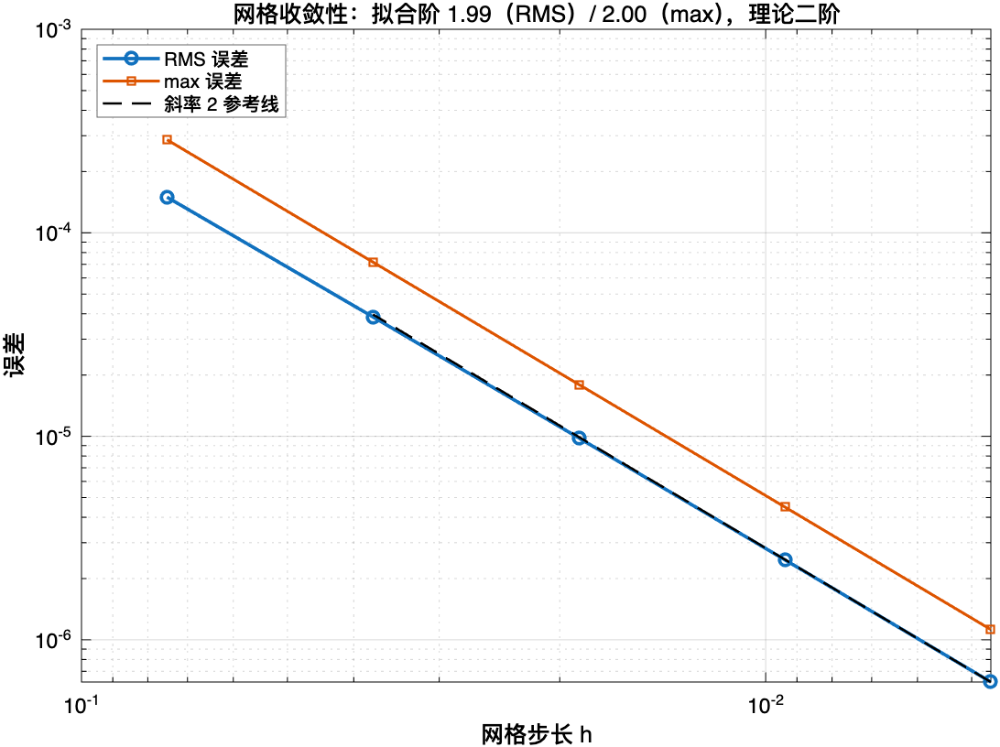
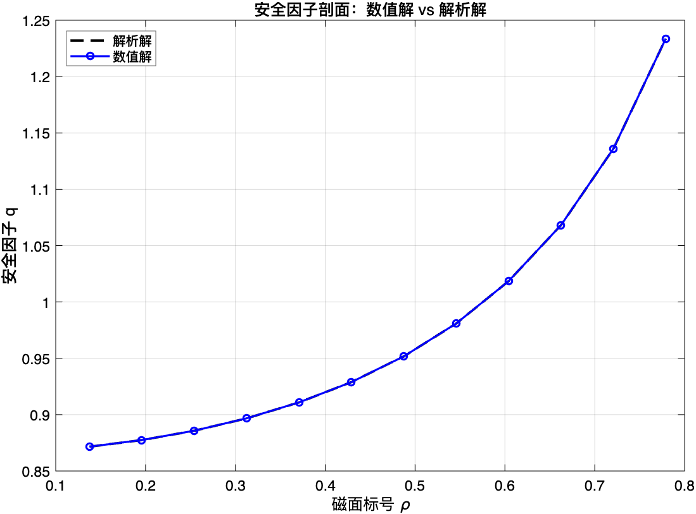
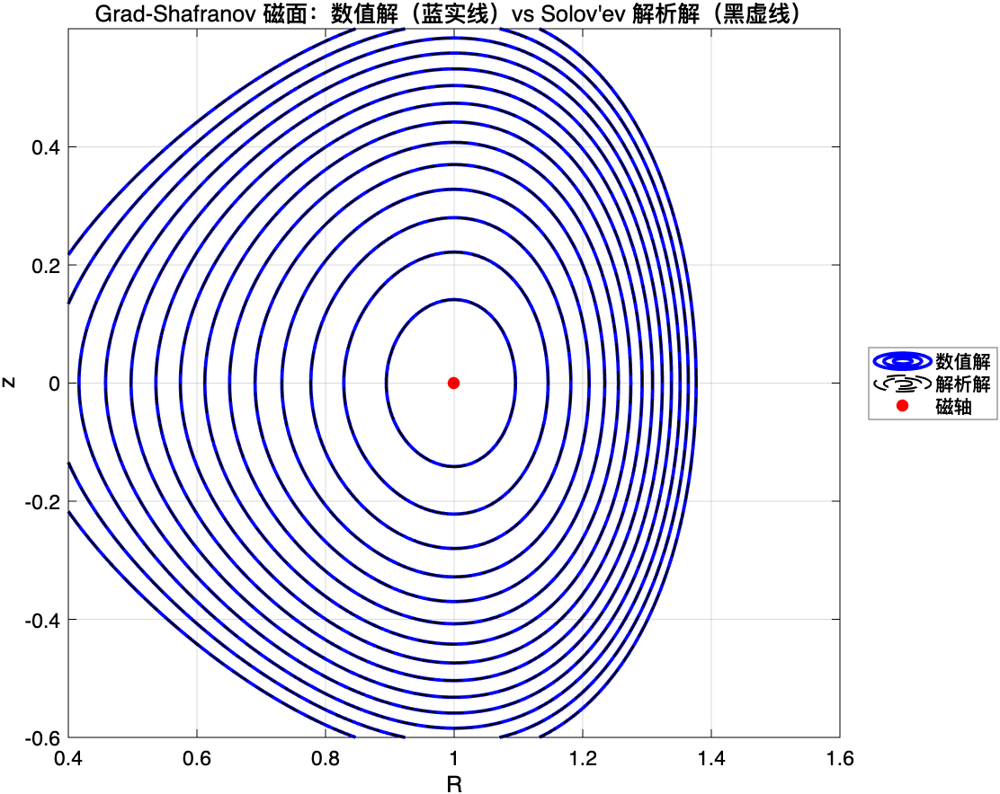

# Grad-Shafranov 平衡求解器（MATLAB）

轴对称磁约束聚变平衡的第一性原理求解器。

用**二阶中心差分**离散 Grad-Shafranov 方程，用**自己构造的 Solov'ev 解析解**做代码验证，
给出**网格收敛阶**、**Richardson 外推 / GCI**、**磁轴位置**、**安全因子 q 剖面**，
并附带离散矩阵性质与线性求解器选型的实测对比。

MATLAB 实测通过：**R2026a**（只用基础 MATLAB，无任何工具箱依赖）。

> 本文档不使用 LaTeX 数学标记，公式一律写成纯文本，任何 Markdown 阅读器都能正常显示。

---

## 一、物理方程

轴对称等离子体平衡由 Grad-Shafranov 方程描述。起点是磁流体平衡的力平衡关系
**∇p = J × B**（压强往外推，磁场把它箍住）。

托卡马克轴对称，于是由 ∇·B = 0 可引入**极向磁通函数 ψ**：

```
    B = (1/R) · ∇ψ × ê_φ  +  (F/R) · ê_φ ,        F(ψ) = R · B_φ
```

关键性质是 **B_p · ∇ψ = 0**，所以磁力线躺在 ψ 的等值面上——**ψ 的等值面就是磁面**，
整个等离子体的几何由一个标量函数描述。

把 B 代入 J = (∇×B)/μ₀，再由 J × B = ∇p 消去 J，得

```
    Δ*ψ = − μ₀ R² (dp/dψ) − F (dF/dψ)

    Δ* ≡ ∂²/∂R² − (1/R)·∂/∂R + ∂²/∂z²
```

右端是两个**待定剖面函数** p(ψ) 与 F(ψ)，且它们以 ψ 为自变量，所以方程是**拟线性**的。

### Solov'ev 剖面与本仓库的解析解

取 p 与 **F²** 都是 ψ 的线性函数（注意是 F² 而不是 F，因为方程里出现的是
F·F' = (F²)'/2）：

```
    μ₀ · dp/dψ = A        （常数）
    F · dF/dψ  = F1/2 = B （常数）
```

于是方程退化为**右端为常数的线性椭圆方程**：

```
    Δ*ψ = − A·R² − B
```

本仓库使用的解析解（可直接代入验证）：

```
    ψ(R,z) = (A/8) · [ R0⁴ − (R² − R0²)² ] − (B/2) · z²
```

验证用的算子恒等式：`Δ*(R⁴) = 8R²`、`Δ*(R²) = 0`、`Δ*(1) = 0`、`Δ*(z²) = 2`，
所以 `Δ*ψ = (A/8)·(−8R²) − (B/2)·2 = −A·R² − B` ✓

**磁面形状**：ψ = 常数 等价于

```
    (R² − R0²)² + (4B/A) · z² = ρ²
```

是以磁轴 (R0, 0) 为中心的一族闭合曲线（ρ 越大磁面越大），纵向拉长——形状与托卡马克平衡相似。

### 默认参数

| 参数 | 值 | 含义 |
|---|---|---|
| A | 2.0 | μ₀ · dp/dψ |
| B | 1.0 | F · dF/dψ（= F1/2） |
| R0 | 1.0 | 磁轴大半径 |
| F0 | 1.0 | F² = F0² + F1·ψ 的常数项 |
| F1 | 2.0 | 与 B 一致（= 2B） |
| R 范围 | [0.4, 1.6] | 避开 R = 0 处的 1/R 奇异 |
| z 范围 | [−0.6, 0.6] | |

---

## 二、文件

| 文件 | 说明 |
|---|---|
| `GS_main.m` | 主脚本：求解 → 网格收敛性 → Richardson/GCI → q 剖面 → 绘图 |
| `gs_solve.m` | 矩形域上二阶中心差分离散 + 稀疏直接求解（Dirichlet 边界取自解析解） |
| `gs_exact.m` | Solov'ev 解析解及其偏导数 ∂ψ/∂R、∂ψ/∂z |
| `gs_q.m` | 磁面上安全因子 q 的围道积分（解析解与数值解共用一个函数） |
| `gs_solver_compare.m` | 离散矩阵性质实测 + 线性求解器选型对比（说明为什么不能用 CG） |
| `lightfig.m` | 图窗白底（MATLAB R2025a 起默认深色主题，导出到报告需要白底） |
| `README.md` | 本文件 |

## 三、运行

```matlab
GS_main                 % 约 0.5 秒，出 3 张图 + 2 个 CSV
gs_solver_compare       % 约 1 秒，出矩阵性质与求解器对比
```

> 两个入口脚本都会自动把所在目录加入 MATLAB 路径；
> 若找不到依赖函数会给出明确报错（含当前工作目录）。

**输出**：`fig_gs_flux.png`、`fig_gs_order.png`、`fig_gs_q.png`、
`out_gs_convergence.csv`、`out_gs_q.csv`

---

## 四、结果

### 1. 网格收敛性：二阶验证

离散用二阶中心差分，边界值取自解析解，所以这是纯粹的**代码验证**：
离散误差应以二阶收敛到解析解。

| N | h | RMS 误差 | max 误差 | ψ(轴) | 求解 (s) |
|---|---|---|---|---|---|
| 17 | 7.50e−2 | 1.4968e−4 | 2.8660e−4 | 0.25028453 | 0.000 |
| 33 | 3.75e−2 | 3.8624e−5 | 7.1771e−5 | 0.25007125 | 0.001 |
| 65 | 1.875e−2 | 9.8088e−6 | 1.7966e−5 | 0.25001782 | 0.003 |
| 129 | 9.375e−3 | 2.4715e−6 | 4.4920e−6 | 0.25000446 | 0.015 |
| 257 | 4.688e−3 | 6.2029e−7 | 1.1230e−6 | 0.25000111 | 0.079 |

**观测收敛阶** p = log(e₁/e₂) / log(h₁/h₂)：

| 区间 | order(RMS) | order(max) |
|---|---|---|
| 17 → 33 | 1.9544 | 1.9975 |
| 33 → 65 | 1.9773 | 1.9981 |
| 65 → 129 | 1.9887 | 1.9998 |
| 129 → 257 | **1.9944** | **2.0000** |

理论值 2，实测吻合 ✓



**为什么同时看 RMS 和 max**：RMS 测整体精度，max 测最坏一点。
如果 max 的收敛阶和 RMS 一致，说明误差是光滑、均匀分布的；
如果 max 卡住不降，就说明某处有局部缺陷（边界闭合、R→0 奇性等）。两者都到 2，格式干净。

### 2. Richardson 外推与 GCI

目标量：轴上 ψ（网格关于 R0、z=0 对称，磁轴恰为节点）。

| 量 | 值 |
|---|---|
| 次细网格 N=129 | 0.2500044553 |
| 细网格 N=257 | 0.2500011139 |
| **Richardson 外推值** | **0.2500000000** |
| 解析值 | 0.2500000000 |
| 外推值相对误差 | **1.5×10⁻¹⁰** |
| **GCI（细网格，Fs = 1.25）** | **0.0006 %** |

细网格本身的相对误差是 4.5×10⁻⁶，外推把它改善了约 **11000 倍**。

**误差估计器自身的检验**（因为手上有解析解，可以反过来验证 GCI 准不准）：

```
    GCI 估计的细网格绝对误差 = 1.1138e−06
    真实的细网格绝对误差     = 1.1139e−06
    比值 = 1.000
```

估计值与真值吻合到三位有效数字——这说明的不只是"这一题算得准"，
而是"**这个误差估计方法是可信的**"。

> **诚实说明**：代码里 Fs 取 1.25，但严格按 Roache 的建议，
> GCI 公式只用了两档网格时应取 **Fs = 3.0**，那样 GCI 会变为 **0.0013 %**。
> 两者都很小，但要做严谨应该用连续三档网格算 GCI 并检查一致性。

### 3. 磁轴位置

解析解：R_axis = 1.000000，ψ_axis = 0.25000000。

所有网格上数值解的磁轴都精确落在 **R = 1.000000**（误差 0）；
ψ_axis 的误差从 2.85×10⁻⁴（N=17）降到 1.11×10⁻⁶（N=257），
相邻两档误差比值 ≈ 4，与二阶收敛一致。

### 4. 安全因子 q 剖面

安全因子（磁力线绕环向 q 圈时极向绕 1 圈）：

```
    q(ρ) = F(ψ) / (2π) · ∮ dl / ( R · |∇ψ| )
```

**q 在同一条磁面上是常数**（它是磁通函数），所以每条磁面对应一个 q 值，
剖面图反映的是 q 沿**径向**的分布。

数值解与解析解经**同一个函数**计算，只切换 ψ 与 ∇ψ 的来源：

| ρ | 0.1375 | 0.3124 | 0.4874 | 0.6624 | 0.7790 |
|---|---|---|---|---|---|
| q（数值） | 0.871590 | 0.896734 | 0.951761 | 1.068149 | 1.233682 |
| q（解析） | 0.871566 | 0.896709 | 0.951735 | 1.068119 | 1.233665 |
| 相对差 | 0.003% | 0.003% | 0.003% | 0.003% | **0.001%** |

q 从 0.87 单调升到 1.23，**剖面形状与真实托卡马克一致**。



**为什么这一层的验证比场误差更严**：q 要经过四道放大——
差分求梯度、插值、沿磁面线积分、再除以 |∇ψ|（小梯度处放大）。
导数量比函数量对误差更敏感，所以 0.003% 的吻合说明**梯度精度也是好的**。

### 5. 磁面



数值解（粗蓝实线）与 Solov'ev 解析解（细黑虚线）的磁面完全重合，磁轴在 (1, 0)。
14 条等高线全部闭合且落在计算域内。

> 说明：contour 的一个 level = 一个 ψ 值 = **一条磁面**，一一对应。
> 磁面本身是连续的一族，图上画的条数是人为挑选的。

### 6. 离散矩阵性质与求解器选型

`gs_solver_compare.m` 的实测结果（N = 65，未知量 n = 3969）：

| 性质 | 实测值 | 后果 |
|---|---|---|
| 每行非零元 | 4.94（五点格式） | 稀疏性极好 |
| **非对称度**（‖A−Aᵀ‖_F / ‖A‖_F） | **0.0072** | 来自 −(1/R)·∂/∂R 一阶项 |
| 特征值 | 全部为负（**负定**） | 不是正定 |
| 条件数 cond(A) | 2.25×10³ | 良态 |
| 稀疏 LU（直接法） | 0.003 s | 这个规模直接法就够 |

**关键结论：这个矩阵不能用 CG。** 实测：

| 求解器 | flag | 迭代步数 | 相对残差 |
|---|---|---|---|
| `pcg(A)` | 4 | 0 | Inf |
| `pcg(-A)` | 1 | 511 | 2.7e−09（达不到容差） |
| **`gmres(A)`** | **0** | **207** | **4.4e−13** |
| **`bicgstab(A)`** | **0** | **142** | **5.0e−13** |
| `pcg(-A 的对称部分)` | 0 | 212 | 4.2e−13 |

三条结论：

1. `pcg(A)` **立即失败**——CG 要求矩阵**对称正定**，而 A 负定且非对称；
2. 即使取 −A 变成正定，CG 仍达不到容差，**因为 A 非对称**，而 CG 的理论基础是对称矩阵；
3. 正确选择是 **GMRES / BiCGSTAB**（非对称系统）。

**补充**：Δ* 在**加权内积**（权重 1/R）下是自伴的，所以如果改用
**1/R 加权的 Galerkin 有限元**离散，矩阵会变成对称的，CG 就又能用了。
**选格式和选求解器必须一起考虑。**

---

## 五、开发过程中发现并修正的问题（V&V 实践）

这一节记录三个真实踩过的坑——它们比"结果对"更能说明问题。

### 1. rho_lim 的量纲不一致

磁面必须整个落在矩形域内，所以磁面标号 ρ 受三个约束：

| 约束 | 来源 | 表达式 |
|---|---|---|
| 内边缘 | sqrt(R0²−ρ) ≥ Rmin | ρ ≤ R0² − Rmin² |
| 外边缘 | sqrt(R0²+ρ) ≤ Rmax | ρ ≤ Rmax² − R0² |
| 上下边缘 | (ρ/2)·sqrt(A/B) ≤ zmax | ρ ≤ 2·zmax/sqrt(A/B) |

**三者必须同为 ρ 的一次式。** 原代码把第三项多平方了一次：

```
    R0² − Rmin²          = 0.840000   ← 一次式
    Rmax² − R0²          = 1.560000   ← 一次式
    2·zmax/sqrt(A/B)     = 0.848528   ← 正确的一次式
    (2·zmax/sqrt(A/B))²  = 0.720000   ← 原代码（多平方了一次）
```

后果不是算错，而是**浪费了 15% 的磁面范围**。修正后最大磁面从 ρ = 0.7212 扩到 0.7790，
q 剖面的相对差仍是 0.003%。

> **教训**：三个并排的约束必须同量纲。数值代码最常见的错误不是公式推错，
> 而是单位/量纲悄悄不一致——它往往只表现为"结果差一点"，不会报错。

### 2. 等高线的层次选到了计算域外

原代码 `lev = linspace(0.05, 0.24, 14)`。由 ψ = (A/8)(R0⁴−ρ²) 反推：

```
    ψ = 0.0500  →  ρ = 0.8944，|z|max = 0.6325 > zmax = 0.6   ✗ 出界
    ψ = 0.0646  →  ρ = 0.8611，|z|max = 0.6089 > 0.6          ✗ 出界
```

最外两条磁面被坐标轴裁掉、不闭合，与"嵌套闭合磁面"的图像矛盾。
修正为从域允许的最大磁面对应的 ψ 开始取层次：

```matlab
lev = linspace((A/8)*(R0^4 - rho_lim^2), 0.245, 14);
```


---

## 六、和生产级代码的差距

| 维度 | 本仓库 | 生产级自由边界码 |
|---|---|---|
| 方程 | 线性（Solov'ev 剖面） | 拟线性（一般 p、F）+ Picard 迭代 |
| 计算域 | 矩形 | D 形 / 贴体非结构网格 |
| 边界 | **固定**（Dirichlet 取自解析解） | **自由**（由线圈电流与等离子体电流决定） |
| 离散 | 二阶中心差分 | 有限元 / 差分 / 谱方法，贴体网格 |
| 线性求解 | 稀疏 LU 直接法 | SOR / 多重网格 / Krylov + 预处理 |
| 目的 | **代码验证** | 真实装置平衡重建与设计 |
| 加速 | 无 | 降阶模型 / 代理模型 / GPU |

**下一步**：自由边界（真空区格林函数 + 边界积分）、Picard 迭代处理非线性剖面、
把离散改成 1/R 加权的 Galerkin 形式以恢复矩阵对称性、C++ 移植。

---

## 七、参考

- Cerfon A J, Freidberg J P. *"One size fits all" analytic solutions to the
  Grad–Shafranov equation.* Physics of Plasmas, 2010, **17**: 032502.
- Solov'ev L S. *The theory of toroidal plasma equilibrium.*
  Reviews of Plasma Physics, 1976, **6**: 239.
- Roache P J. *Verification and Validation in Computational Science and Engineering.*
  Hermosa Publishers, 1998.（Richardson 外推与 GCI 的出处）
- Wesson J. *Tokamaks.* Oxford University Press.

---

## 相关项目

- **[UPML-FDTD](../UPML-FDTD)** —— 时域电磁数值稳定性：一维 FDTD-PML 的能量法与
  von Neumann 分析，以及二维 UPML 的论文复现（Fang & Ying, 2009）。
  同一套 V&V 方法论（解析解对标 → 两法互验 → 收敛阶 / GCI）用在另一个方程上。
